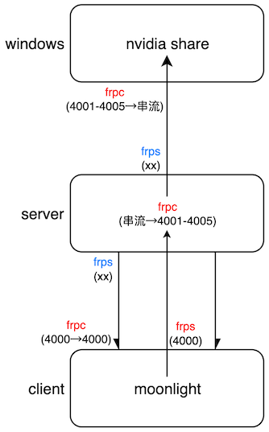

# 利用向日葵远程ssh实现公网串流
- 优势：带宽较高（几十兆带宽以上），不需要买服务器，不限流量，一年1百多（向日葵精英版）
- 借助：向日葵、frp
1. streaming(win) 被控端:
    - 安装ubuntu虚拟机，在里面安装并登录向日葵
2. client 控制端：
    - 首先打开向日葵，ssh连接到安装的ubuntu虚拟机
    - 然后如果是 mac：
      - 进入当前目录，终端运行：./soft/mac_intel/frps -c ./config/client/frps.ini
      - 终端运行：ssh admin@127.0.0.1 -p $(cat /tmp/oray_pipe_*|grep -o '[0-9][0-9][0-9][0-9][0-9]') -R 4000:127.0.0.1:4000
    - 然后如果是 win：
      - 进入当前目录，CMD运行：.\soft\win_64\frpc -c .\config\client\frps.ini
      - 在任务管理器中查看向日葵SSH的PID，然后检索这个PID对应的端口，终端运行： netstat -ano|findstr G.*PID
      - CMD运行：ssh admin@127.0.0.1 -p 查到的端口 -R 4000:127.0.0.1:4000
    - **admin 修改为你的ubuntu虚拟机用户名**
3. streaming(win) 被控端:
    - 从任务管理器中查看当前使用网卡的ip，修改到 ./config/streaming/frpc2.ini
    - ubuntu虚拟机进入当前目录，终端运行：./soft/linux_64/frpc -c ./config/streaming/frpc2.ini
4. 最终client上填写的串流ip: 127.0.0.1
# 利用不开放端口只能连接的公网服务器实现公网串流
- 优势：任何一台你能ssh访问的公网服务器都行，不需要对服务器做任何配置
- 借助：公网服务器、ssh、frp
1. client 控制端，进入当前目录：
    - 如果是 mac，终端运行：./soft/mac_intel/frps -c ./config/client/frps.ini
    - 如果是 win，CMD运行：.\soft\win_64\frpc -c .\config\client\frps.ini
    - 最后终端或CMD运行：ssh 服务器用户名@服务器IP -p 服务器端口 -R 4000:127.0.0.1:4000
2. streaming(win) 被控端:
    - 进入当前目录，CMD运行：.\soft\win_64\frpc -c .\config\streaming\frpc3.ini
    - CMD运行：ssh 服务器用户名@服务器IP -p 服务器端口 -L 4000:127.0.0.1:4000
3. 最终client上填写的串流ip: 127.0.0.1
# 利用只有一个公开端口的服务器实现公网串流
## 介绍
- 公网nat服务器用于frp穿透串流moonlight, server端口不能用8个固定串流端口或一台server串流多个win时的解决方案
- 只需要任意1个公网tcp端口, 基于frp: server和client端各开6和9个内部端口即可, 除了client内部8串流端口固定, 其他端口随意
  - server
      - frps 监听: xx, 4001-4005 (win.frpc), 4000 (client.frpc)
      - frpc 访问: 4000
          - 转发: 8串流 → 4001-4005
  - win
      - frpc 访问: xx
          - 转发: 4001-4005 → 8串流
  - client
      - frps 监听: 1000, 8串流 (server.frpc)
      - frpc 访问: xx
          - 转发: 4000 → 4000
  - 启动顺序: server.frps, client.frps → win.frpc, client.frpc → server.frpc
  - 8个串流端口
      - TCP 47984, 47989, 48010
      - UDP 47998, 47999, 48000, 48002, 48010
  - 最终client上填写的串流ip: 127.0.0.1
  - 原理图: 

## 首先: 进入配置文件修改为自己的ip和端口
1. 修改为自己的服务器公网tcp端口: config/server/frps.ini
2. 修改为自己的服务器ip+公网tcp端口: config/client/frpc.ini
3. 修改为自己的服务器ip+公网tcp端口: config/streaming/frpc.ini

## 然后: 进入当前目录执行步骤
0. 如果需要赋予权限: chmod -R 777 .
1. server: ./soft/linux_64/frps -c ./config/server/frps.ini
2. client: 3种机器
   - win: .\soft\win_64\frps -c .\config\client\frps.ini
   - mac-silicon: ./soft/mac_apple/frps -c ./config/client/frps.ini
   - mac-intel: ./soft/mac_intel/frps -c ./config/client/frps.ini
3. client: 3种机器
   - win: .\soft\win_64\frpc -c .\config\client\frpc.ini
   - mac-silicon: ./soft/mac_apple/frpc -c ./config/client/frpc.ini
   - mac-intel: ./soft/mac_intel/frpc -c ./config/client/frpc.ini
4. streaming(win): .\soft\win_64\frpc -c .\config\streaming\frpc.ini
5. server: ./soft/linux_64/frpc -c ./config/server/frpc.ini

## 安装 iperf3
- win: https://files.budman.pw
- mac:
  - /bin/bash -c "$(curl -fsSL https://raw.githubusercontent.com/Homebrew/install/HEAD/install.sh)"
  - brew install iperf3
- centos: yum install iperf3
- ubuntu: apt install iperf3

## 关闭串流端口进行 iperf3 测试
- streaming(win): .\iperf3 -s -p 48010
- client:
  - udp上传: iperf3 -c 127.0.0.1 -p 48010 -u -l 1k
  - udp下载: iperf3 -c 127.0.0.1 -p 48010 -u -l 1k -R
  - tcp上传: iperf3 -c 127.0.0.1 -p 48010
  - tcp下载: iperf3 -c 127.0.0.1 -p 48010 -R

# 文件基于 frp v0.42.0: https://github.com/fatedier/frp
